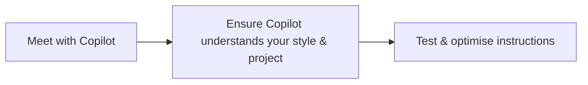
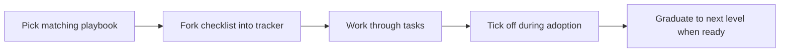

# Copilot Adoption Playbooks

This folder holds **step‑by‑step guides** (checklists + [Mermaid](https://mermaid-js.github.io/) diagrams) for rolling out GitHub Copilot to legacy projects of different maturity levels.

---

## 🎯 Goal & Purpose

*Provide a **clear, repeatable roadmap** for teams who want to unlock Copilot’s productivity gains **without compromising quality or safety**.*

1. **Reduce risk** – Every playbook starts with guard‑rails (tests, CI, policy files) before enabling code generation.
2. **Meet teams where they are** – Three maturity levels mean you don’t have to “boil the ocean” up front.
3. **Accelerate onboarding** – Copy‑paste tasks into your tracker and tick them off; no blank‑page syndrome.
4. **Share knowledge visually** – Mermaid diagrams are easy to embed in wikis, PRs, or slide decks.

---

| Folder                 | Target project type             | One‑liner                              |
| ---------------------- | ------------------------------- | -------------------------------------- |
| [`level-1/`](level-1/) | ✅ Well‑tested, documented code  | “Flip the switch and optimise.”        |
| [`level-2/`](level-2/) | 🟡 No tests, decent structure   | “Build a safety net, then accelerate.” |
| [`level-3/`](level-3/) | 🔴 Low‑quality, sparse docs     | “Stabilise, characterise, refactor.”   |

### Level‑0 Quick‑start Chart

**Step overview**

1. **Meet with Copilot** – enable Copilot in your IDE, take time to read the documentation or watch a short video to discover key features.
2. **Understand style & project** – feed Copilot your coding guidelines and ask it to summarise key components, then explore the [templates](../templates/) folder for concrete prompt‑driven examples.
3. **Test & optimise instructions** – generate a small change, verify tests pass, and refine your custom instructions.

---

## How to use

1. Pick the playbook matching your project’s current maturity.
2. Fork the checklist into your issue tracker.
3. Work through the tasks; tick them off during adoption.
4. When the project’s maturity improves, graduate to the next level.

---

## Adding new playbooks

1. Create a new folder `level-4/` or `mobile-app/` (use lowercase, kebab‑case).
2. Include **Checklist.md** & **.mmd**.
3. Render a PNG or SVG and update the table above.

---

Happy onboarding! If you have improvements or discover new patterns, please open a PR.
