# Level 1: GitHub Copilot for Well-Tested, Documented Code Projects

> **Target**: ✅ Projects with existing tests, good documentation, and established coding standards  
> **Goal**: "Flip the switch and optimize" - Maximize Copilot productivity while maintaining quality

---

## 🎯 Overview

For mature projects with solid foundations, GitHub Copilot can immediately boost productivity. This playbook focuses on:

- Setting up custom instructions that align with your project standards
- Validating Copilot understands your codebase
- Leveraging Copilot for documentation, code quality, and feature development
- Maintaining test coverage and code quality standards

---

## Adoption Workflow

```mermaid
graph TD
    A[Enable GitHub Copilot] --> B[Review Project Standards]
    B --> C[Create Custom Instructions]
    C --> D[Test Basic Functionality]
    D --> E[Validate Project Alignment]
    
    E --> F[Generate Documentation]
    F --> G[Improve Code Comments]
    G --> H[Update README & API Docs]
    
    H --> I[Analyze Test Coverage]
    I --> J[Generate Additional Tests]
    J --> K[Refactor with Copilot]
    K --> L[Validate All Tests Pass]
    
    L --> M[Plan New Feature]
    M --> N[Implement with TDD]
    N --> O[Generate Feature Tests]
    O --> P[Document New Feature]
    P --> Q[Code Review & Deploy]
    
    Q --> R[Monitor & Optimize]
    R --> S[Continuous Improvement]
    
    style A fill:#e1f5fe
    style E fill:#f3e5f5
    style H fill:#e8f5e8
    style L fill:#fff3e0
    style Q fill:#fce4ec
    style S fill:#f1f8e9
    
    click A "#phase-1-setup--alignment" "Go to Phase 1: Setup & Alignment"
    click B "#phase-1-setup--alignment" "Go to Phase 1: Setup & Alignment"
    click C "#-custom-instructions-template" "Go to Custom Instructions Template"
    click D "#phase-1-setup--alignment" "Go to Phase 1: Setup & Alignment"
    click E "#-validation-steps" "Go to Validation Steps"
    click F "#phase-2-documentation--quality" "Go to Phase 2: Documentation & Quality"
    click G "#phase-2-documentation--quality" "Go to Phase 2: Documentation & Quality"
    click H "#-documentation-generation-prompts" "Go to Documentation Generation Prompts"
    click I "#phase-3-code-quality--coverage" "Go to Phase 3: Code Quality & Coverage"
    click J "#-quality-assurance-prompts" "Go to Quality Assurance Prompts"
    click K "#-quality-assurance-prompts" "Go to Quality Assurance Prompts"
    click L "#phase-3-code-quality--coverage" "Go to Phase 3: Code Quality & Coverage"
    click M "#phase-4-feature-development" "Go to Phase 4: Feature Development"
    click N "#-feature-development-workflow" "Go to Feature Development Workflow"
    click O "#-feature-development-workflow" "Go to Feature Development Workflow"
    click P "#-feature-development-workflow" "Go to Feature Development Workflow"
    click Q "#-best-practices" "Go to Best Practices"
    click R "#-success-metrics" "Go to Success Metrics"
    click S "#-continuous-improvement" "Go to Continuous Improvement"
```



---

## ✅ Adoption Checklist

### Phase 1: Setup & Alignment

- [ ] **Enable GitHub Copilot** in your IDE
- [ ] **Review project documentation** - Identify coding standards, style guides, and architectural patterns
- [ ] **Create custom instructions** (see [Custom Instructions Template](#-custom-instructions-template))
- [ ] **Validate project alignment** with custom instructions (see [Validation Steps](#-validation-steps))

### Phase 2: Documentation & Quality

- [ ] **Generate missing documentation** using Copilot
- [ ] **Improve code comments** for complex functions
- [ ] **Create/update README sections** with Copilot assistance
- [ ] **Generate API documentation** if applicable
- [ ] **Review and refine** all Copilot-generated documentation

### Phase 3: Code Quality & Coverage

- [ ] **Analyze current test coverage** baseline
- [ ] **Ask Copilot to identify** untested code paths
- [ ] **Generate additional tests** to improve coverage (without modifying existing tests)
- [ ] **Refactor code** with Copilot suggestions while maintaining functionality
- [ ] **Validate all tests pass** after Copilot-assisted changes

### Phase 4: Feature Development

- [ ] **Plan a small new feature** with clear requirements
- [ ] **Use Copilot for feature implementation** following TDD principles
- [ ] **Generate comprehensive tests** for the new feature
- [ ] **Document the new feature** with Copilot assistance
- [ ] **Code review** Copilot-generated code with team
- [ ] **Deploy and monitor** the new feature

---

## 🛠 Custom Instructions Template

Create a `.copilot-instructions.md` file in your project root. You can use one of the available templates as a starting point:

### Available Templates

Choose the template that best matches your project:

- **[General Template](../../templates/general/GH_Custom_Instruction.md)** - Universal guidelines for any programming language
- **[Python Module](../../templates/python-module/.github/copilot-instructions.md)** - Python-specific instructions with testing focus
- **[Python Django](../../templates/python-django/.github/copilot-instructions.md)** - Django web application guidelines
- **[Jupyter Notebooks](../../templates/jupyter/.github/copilot-instructions.md)** - Data science and analysis workflows
- **[Experimental Split Instructions](../../templates/python-module-experimental/.github/)** - VS Code 1.100+ split instruction files

### Basic Template Structure

```markdown
# GitHub Copilot Custom Instructions

## Project Context
- **Language**: [Your primary language]
- **Framework**: [Your framework/stack]
- **Architecture**: [Brief description of your architecture]
- **Domain**: [Business domain/purpose]

## Coding Standards
- Follow [Your style guide] (e.g., PEP 8, Google Style Guide)
- Use [Your naming conventions]
- Maximum line length: [X characters]
- Indentation: [spaces/tabs and count]

## Testing Requirements
- Write unit tests for all new functions
- Use [Your testing framework] (e.g., pytest, Jest, JUnit)
- Aim for >X% test coverage
- Follow AAA pattern (Arrange, Act, Assert)

## Documentation Standards
- Document all public APIs
- Use [Your documentation format] (e.g., JSDoc, Sphinx, Javadoc)
- Include examples in docstrings
- Update README for new features

## Code Quality
- Prefer composition over inheritance
- Use meaningful variable names
- Keep functions small and focused
- Handle errors gracefully
- Follow SOLID principles

## Dependencies
- Prefer established libraries over custom implementations
- Document reasons for new dependencies
- Keep dependencies up to date
- Avoid deprecated packages
```

### For Advanced Users: Split Instruction Files

If you're using VS Code 1.100+, consider using the [experimental split instruction files](../../templates/python-module-experimental/README.md) approach:

- `code-generation.instructions.md` - Code generation guidelines
- `test-generation.instructions.md` - Test creation standards
- `code-review.instructions.md` - Code review criteria
- `commit-message.instructions.md` - Commit message format
- `pr-description.instructions.md` - Pull request descriptions


 Or check the official documentation: 
 [GitHub Copilot Custom Instructions(VS Code Doc)](https://code.visualstudio.com/docs/copilot/copilot-customization#_specify-custom-instructions-in-settings)


---

## ✅ Validation Steps

### 1. Project Understanding Test

Ask Copilot to:

```text
Analyze this codebase and summarize:
1. The main purpose and functionality
2. Key architectural patterns used
3. Primary technologies and frameworks
4. Testing strategy and coverage
5. Documentation approach
```


### 2. Code Style Alignment Test

- Generate a small function using Copilot
- Verify it matches your coding standards
- Check formatting, naming conventions, and structure
- Compare with existing code patterns

### 3. Testing Knowledge Test

Ask Copilot to:

```text
Look at our existing test suite and:
1. Identify the testing framework and patterns we use
2. Generate a test for [existing function] following our conventions
3. Suggest improvements to test organization
```

---

## 📚 Documentation Generation Prompts

### README Enhancement

```text
Review our README.md and suggest improvements:
1. Add missing sections (Installation, Usage, Contributing)
2. Improve code examples with current syntax
3. Add troubleshooting section
4. Update badges and links
```

### API Documentation

```text
Generate comprehensive API documentation for [module/class]:
1. Include all public methods with parameters and return types
2. Add usage examples for each method
3. Document exceptions that may be raised
4. Follow our established documentation format
```

### Code Comments

```text
Add meaningful comments to this function explaining:
1. Purpose and business logic
2. Complex algorithms or calculations
3. Edge cases handled
4. Performance considerations
```

---

## 🧪 Quality Assurance Prompts

### Code Review Assistant

```text
Review this code for:
1. Adherence to our coding standards
2. Potential bugs or edge cases
3. Performance improvements
4. Security considerations
5. Maintainability issues
```

### Test Coverage Analysis

```text
Analyze our test coverage and:
1. Identify untested code paths
2. Suggest additional test cases
3. Find edge cases we might have missed
4. Recommend integration test scenarios
DO NOT modify existing tests - only suggest new ones
```

### Code Quality Improvements

```text
Suggest refactoring improvements for this code:
1. Reduce complexity without changing functionality
2. Improve readability and maintainability
3. Apply design patterns where appropriate
4. Optimize performance if needed
Keep all existing tests passing
```

---

## 🚀 Feature Development Workflow

### 1. Requirements Analysis

```text
Help me break down this feature request into:
1. User stories with acceptance criteria
2. Technical requirements and constraints
3. Potential edge cases to consider
4. Testing strategy for the feature
```

### 2. Implementation Planning

```text
Create an implementation plan for [feature]:
1. Identify modules/files that need changes
2. Suggest the order of implementation
3. Highlight integration points
4. Recommend testing approach
```

### 3. Test-Driven Development

```text
Following TDD, help me:
1. Write failing tests for [feature] first
2. Implement minimal code to make tests pass
3. Refactor for better design
4. Add integration tests
```

### 4. Documentation Updates

```text
Update documentation for the new feature:
1. Add to main README if user-facing
2. Update API docs for new methods
3. Add code examples and usage patterns
4. Update changelog with new feature
```

---

## 🎓 Best Practices

### Do's ✅

- Always review Copilot suggestions before accepting
- Use Copilot to explain complex existing code
- Leverage Copilot for boilerplate and repetitive tasks
- Ask Copilot to generate comprehensive test cases
- Use Copilot to improve code documentation
- Validate all generated code against your standards

### Don'ts ❌

- Don't accept suggestions without understanding them
- Don't modify existing working tests without careful review
- Don't bypass your code review process
- Don't ignore security implications of generated code
- Don't over-rely on Copilot for critical business logic
- Don't skip testing of Copilot-generated code

---


## 📚 Additional Resources

- [GitHub Copilot Documentation](https://docs.github.com/en/copilot)
- [Best Practices for AI-Assisted Development](../readme-copilot-101-in-20mins.md)
- [Marking AI-Generated Code](../readme-marking-tests-ai-generated.md)
- [Project Templates](../../templates/) - Complete template collection with examples
- [Template Overview](../../templates/README.md) - Status and descriptions of all available templates

---

*Ready to supercharge your well-tested project with GitHub Copilot? Start with Phase 1 and work through the checklist at your own pace!*