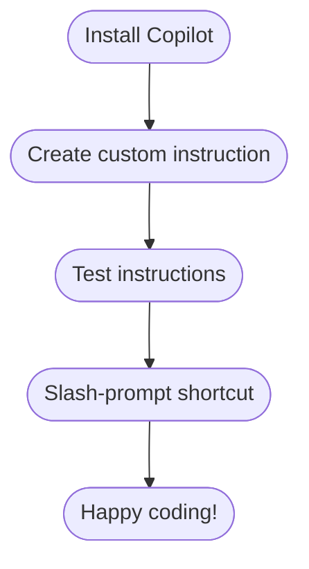

# Copilot Quick‑Start for Beginners 🚩

> **Goal:** Get your first taste of GitHub Copilot in under 20 minutes—no prior AI experience needed.

---

### 📊 Quick Flow



---

> **Need inspiration?** Browse the [samples](../samples/) directory for ready‑made mini projects you can practice on.

## 🛠 1 · Install Copilot

1. Open **VS Code** (or JetBrains IDE).
2. Go to **Extensions ⇢ Marketplace** and search **“GitHub Copilot”**.
3. Click **Install** → **Sign in** with your GitHub account.
4. You’re done! A ✨ icon appears in the status bar.

> *Tip — If you’re on a student license, Copilot is free!*

---

## ✍️ 2 · Create a custom instruction

Copilot works best when it knows your style. Add a small file so it can read it each time — see an [example instruction file](../samples/README.md).

```text
# .github/copilot-instructions.md
Write Python in PEP 8 style.
Use descriptive variable names.
Always add type hints.
```

Commit & push the file—Copilot will now follow these rules automatically.

---

## 🧪 3 · Test the instructions

Let’s create a **tiny feature** and **unit tests** to see Copilot in action.

1. In a new folder, create **`sum_numbers.py`** and type only the doc‑string:

   ```python
   def sum_numbers(numbers: list[int]) -> int:
       """Return the sum of a list of integers."""
   ```

   *Pause after the doc‑string—Copilot will suggest the rest of the function.*

2. Accept the suggestion (`Tab`).

3. Make a **`tests`** folder. Add **`test_sum_numbers.py`** and type `pytest` skeleton; Copilot should fill the edge‑case tests.

4. Run:

   ```bash
   python -m pip install pytest
   pytest -q
   ```

**Iterate until output is not what you expect. Refine the instructions and repeat**

> 💡 **Hint:** If Copilot’s suggestions seem off, try specifying the language or framework in your prompt, or check that you’re using the right Copilot model (e.g., Copilot Chat vs. inline). Sometimes switching models or reloading the editor helps! See https://github.blog/ai-and-ml/github-copilot/which-ai-model-should-i-use-with-github-copilot/ by @cassidoo

### 🤖 Example testing prompts

Try these Copilot Chat prompts to generate or improve tests:

| Goal                           | Prompt                                                                                                                           |
| ------------------------------ | -------------------------------------------------------------------------------------------------------------------------------- |
| Generate documentation from code| `"Generate comprehensive doc-strings and a markdown documentation section for all functions and classes in this file."`          |
| Generate basic tests           | `"Write pytest cases for sum_numbers() covering empty list, one element, negative numbers."`                                     |
| Improve failing test           | `"Fix the failing test in test_sum_numbers.py and explain what was wrong."`                                                      |
| Create Mermaid component diagram| `"@mermaid create diagram of the main components (ask mode needed)"`                                                            |
| Visualize script sequence      | `"@mermaid visualize in sequence what the script does"`                                                                          |

Copy‑paste any prompt, tweak names, and watch Copilot draft the tests for you.

---

## 🔁 4 · Create slash‑prompt shortcuts

If you repeat certain prompts, save them as chat *commands*.

1. Open Copilot Chat panel.
2. Type `/alias` to create a new shortcut (JetBrains) **or** add a snippet in VS Code.

Example command **`/my-prompt`**:

```text
Rewrite the selected code to use list comprehensions and add type hints.
```

Now you can simply type:

```
/my-prompt  # Copilot expands the template
```

Add `<additional info>` after the command if you need context.

> **Where to store commands:**
> • **JetBrains IDEs:** *Settings → Tools → GitHub Copilot → Custom Commands* (saves to `~/.config/github‑copilot/aliases.json`).
> • **VS Code:** create a snippet file like `.vscode/copilot-snippets.code-snippets` (name must end with `.code-snippets`).
> Check the [sample snippet file](../samples/python-module/.vscode/copilot-snippets.code-snippets) for a ready template.

---

## 📚 Using Copilot → Coding Best Practices Flow

1. **Create documentation first** – start every new feature with a short `README.md` or section in your main docs, and annotate key data structures directly in code.
2. **Focus on code coverage** – if you’re letting Copilot write most of the code, double‑down on *tests*. Aim for ≥ 80 % coverage and block PRs that lower it.
3. **Comment for context** – well‑placed comments help AI (and humans) understand intent, resulting in better suggestions.
4. **Visualise with Mermaid** – insert sequence, class, or flow charts in your markdown so Copilot Chat can reason about architecture.

> The prepared [samples](../samples/) follow these conventions—use them as blueprints.

---

## 🚀 Next steps

* Explore more prompt recipes in [`samples/`](../samples/).
* Try generating doc‑strings or SQL queries.
* When comfortable, move on to the full **Level‑1 Playbook**.

Happy coding! If you hit issues, open a Discussion or ask a teammate. 👋
