# Copilot Quick‑Start for Beginners 🚩

> **Goal:** Get your first taste of GitHub Copilot in under 20 minutes—no prior AI experience needed.

---

### 📊 Combined Flow and Roadmap

```mermaid
flowchart LR
    A[🚀 Install Copilot] --> B[📝 Create custom instruction]
    B --> C[🧪 Test instructions]
    C --> D[⚡ Slash‑prompt shortcuts]
    D --> E[😊 Happy coding!]
    E --> F[📚 Best Practices]
    click A "#1-install-copilot"
    click B "#2-create-a-custom-instruction"
    click C "#3-test-the-instructions"
    click D "#4-create-slash-prompt-shortcuts"
    classDef stepStyle fill:#fceabb,stroke:#e1a12f,stroke-width:2px,rx:5,ry:5;
    class A,B,C,D,E,F stepStyle;
```



---

> **Need inspiration?** Browse the [templates](../templates/) directory for ready‑made mini projects you can practice on.

## 🛠 1 · Install Copilot

1. Open **VS Code** (or JetBrains IDE). ⚙️
2. Go to **Extensions ⇢ Marketplace** and search **“GitHub Copilot”**.
3. Click **Install** → **Sign in** with your GitHub account.
4. You’re done! A ✨ icon appears in the status bar.

> *Tip — If you’re on a student license, Copilot is free!*

---

## ✍️ 2 · Create a custom instruction

Copilot works best when it knows your style. Add a small file so it can read it each time — see an [example instruction file](../templates/README.md).

```text
# .github/copilot-instructions.md
Write Python in PEP 8 style.
Use descriptive variable names.
Always add type hints.
Add comment that I am author and using Copilot.:-) 
```

> **Note:** 🚨 **IMPORTANT:** The customized instruction is a must-have for an optimal Copilot experience. 🌟✨


---

## 🧪 3 · Test the instructions

Let’s create a **tiny feature** and **unit tests** to see Copilot in action.

1. In a new folder, create **`sum_numbers.py`** and type only the doc‑string:

   ```python
   def sum_numbers(numbers: list[int]) -> int:
       """Return the sum of a list of integers."""
   ```

   *Pause after the doc‑string—Copilot will suggest the rest of the function.*

2. Create a **`tests`** folder. Add **`test_sum_numbers.py`**. Copilot should fill the edge‑case tests.

3. Iterate on the function and tests until you’re happy with the results.


**Iterate until output is not what you expect. Refine the instructions and repeat**

> 💡 **Hint:** If Copilot’s suggestions seem off, try specifying the language or framework in your prompt, or check that you’re using the right Copilot model (e.g., Copilot Chat vs. inline). Sometimes switching models or reloading the editor helps! See https://github.blog/ai-and-ml/github-copilot/which-ai-model-should-i-use-with-github-copilot/ by @cassidoo

### 🤖 Example testing prompts

Try these Copilot Chat prompts to generate or improve tests:

| Goal                           | Prompt                                                                                                                           |
| ------------------------------ | -------------------------------------------------------------------------------------------------------------------------------- |
| Generate documentation from code| `"Generate comprehensive doc-strings and a markdown documentation section for all functions and classes in this file."`          |
| Generate basic tests           | `"Write pytest cases for sum_numbers() covering empty list, one element, negative numbers."`                                     |
| Improve failing test           | `"Fix the failing test in test_sum_numbers.py and explain what was wrong."`                                                      |
| Create Mermaid component diagram| `"@mermaid create diagram of the main components (ask mode needed)"`                                                            |
| Visualize script sequence      | `"@mermaid visualize in sequence what the script does"`                                                                          |

Copy‑paste any prompt, tweak names, and watch Copilot draft the tests for you.

---

## 🔁 4 · Create slash‑prompt shortcuts

Instead of using local snippets, store reusable prompt commands in a workspace prompt file.

1. Create a folder `.github/prompts` at the root of your repository if it doesn't exist.
2. Create a file named `slash-prompts.prompt.md` inside `.github/prompts`.
3. Add your custom command in the file. For example:

```text
/alias /my-prompt
Rewrite the selected code to use list comprehensions and add type hints.
```

4. Now, in Copilot Chat simply type:
```
/my-prompt  # Copilot expands the prompt
```
You can append additional context after the command if needed.

> **Note:** This workspace variant centralizes your custom commands across your team and projects.

---

## 📚 Using Copilot → Coding Best Practices Flow

1. **Create documentation first** – start every new feature with a short `README.md` or section in your main docs, and annotate key data structures directly in code.
2. **Focus on code coverage** – if you’re letting Copilot write most of the code, double‑down on *tests*. Aim for ≥ 80 % coverage and block PRs that lower it.
3. **Comment for context** – well‑placed comments help AI (and humans) understand intent, resulting in better suggestions.
4. **Visualise with Mermaid** – insert sequence, class, or flow charts in your markdown so Copilot Chat can reason about architecture.

> The prepared [templates](../templates/) follow these conventions—use them as blueprints.

---

## 🚀 Next steps

* Explore more prompt recipes in [`templates/`](../templates/).
* Try generating doc‑strings or SQL queries.
* When comfortable, move on to the full **Level‑1 Playbook**. +*//TODO*

Happy coding! If you hit issues, open a Discussion or ask a teammate. 👋
